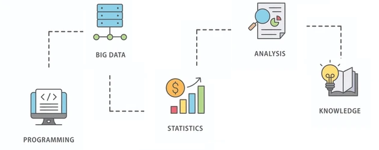

<!-- Banner Section -->

<h1 align="center">📊 Intelligent Data Analytics</h1>
  

  A collection of projects covering various topipcs of statistics and techniques for data manipulation, visualization, dimensionality reduction and analysis.

---

## 📁 Repository Structure

This repository contains six independent data analysis projects. Each project is self-contained in its own folder and covers different methods and tools in intelligent data analysis, including exploratory analysis, modeling, dimensionality reduction, and interpretation.

### 🧠 Project Index

| Project Name                         | Badge Link                                  |
|-------------------------------------|---------------------------------------------|
| Exploratory Data Analysis                 |  |
| Statistical Tests                        |  |
| Principal Component Analysis (PCA)            |  |
| Simple and Multiple Correspondence Analysis  |  |
| ANOVA and Data Visualization           |  |
| Logistic Regression |                  |

## 🎓 Academic Context

* This project was developed as part of the Data Analytics Intelligence (AID) course within the Master’s in Data Exploitation and Knowledge Discovery program at <strong>FCEN – University of Buenos Aires (UBA)</strong>.

---
  
## ✍️ **Author**  

**Yair Barnatan**

[LinkedIn](https://www.linkedin.com/in/yair-barnatan/) | [GitHub](https://github.com/ybarnatan)

📧 Email: ybbarnatan@gmail.com
